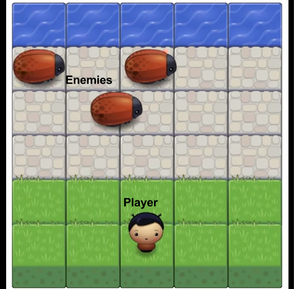

Frontend Project 4: Arcade Game
===============================
Author: Alan Spiewak  GitHub repo = arspiewak / frontend-nanodegree-arcade-game

## Running the project
The Arcade Game project is hosted as a GitHub page and can be accessed online from [this link](http://arspiewak.github.io/frontend-nanodegree-arcade-game/index.html). The game board is not resizable, so for best results, I suggest that you use a browser that has a window width of at least 505 pixels. Browsers that do not support HTML 5's Canvas facility (IE versions before 9 and Opera Mini) will not display the game.

## Playing the game

At the start of the game, you will see a board that looks like this (minus the text labels):

  

The avatar in the middle of the bottom row respresents you, the player. You can move your avatar to an adjacent square on the board by pressing the up, down, left, and right arrows on your keyboard. When you come to the edge of the screen, your avatar will not progress any further (the board does not wrap around).

The goal of the game is to move your avatar up from the bottom row and into the top row, the water. To get there, you have to cross the three paved rows where Enemies (bugs) are running from left to right. If you enter a square that contains part of a bug, you collide with the bug and die. Whether you win or die, you immediately reappear in the original starting position, able to start over again.

To stop the game, press the `Esc` key. There is no way to pause and resume the game.

Happy playing!

### Enhancements to the basic project design
Beyond the basic requirements (achieved by the version at repo branch _minimal_function_), I have added the following functionality:
- The page's HTML and CSS have been styled to match my Portfolio project, previously submitted as part of the Udacity Frontend Nanodegree. My plan was for the game to integrate visually with the project page that presents it to visitors. I have made the design as responsive as I could, but since HTML5 Canvas elements do not resize automatically, my success was constrained.
- When the player reaches the goal (wins) or is hit by a bug (loses), I have added animation: The player image changes (adds a halo for a win or becomes a ghost by color inversion for a hit). That version is displayed in place for one second while the bugs continue to run. After that second, the normal avatar reappears in the start position, as specified in the assignment.
- As a demonstration of JavaScript's object features, I added an object to represent the game board itself. Static data describing the board (including the dimensions used by the engine to create the canvas) are part of this object, and methods of the board object are used to manage collision detection and convert `(row, column)` coordinates to pixel coordinates.
- I intentionally used two different techniques for data encapsulation. In the Enemy class, all properties and methods are public. Almost no private closure objects are used. For the Player class, almost all data is contained in the constructor function's closure and is not visible outside the object. I was able to do this because there is only one Player in the game. If that design were to change, my implementation would need a lot of refactoring.
- I added a key definition (`Esc`) to terminate the game cleanly.

### Credits
All graphics except the author's avatar in the banner row of `index.html` (property of the author) are provided by, or adapted from images provided by, Udacity. The following modifications were made by the author:

- **anti-char-boy.png** is inverted from the player avatar `char-boy.png`.
- **Star2.png** is adapted from `Star.png` by moving the opaque portions of the image higher, to form a "halo" around the player avatar's head.
- **BoardScreenshot.png** was extracted from the file `Frogger Game Start.docx` (_Frogger Game: Getting Started_), downloaded from the Udacity assignment page.
- **UdacityProject.png**, used in the banner of `index.html`, was adapted from `udacity_share.png`, downloaded from http://www.udacity.com .

The JavaScript files `app.js`, `engine.js`, and `resources.js` were downloaded from the project repository as part of the Udacity assignment. While `engine` and `resources` are largely unchanged, my changes to `app` were extensive. To see the exact modifications I have made to project, `diff` the head of the _master_ branch with the branch _from-udacity_ in [my repository](https://github.com/arspiewak/frontend-nanodegree-arcade-game/).

The design for the page surrounding the game board is my own work, but parts of it are repurposed from the _Portfolio_ project previously submitted. Page presentation includes the use of the `bootstrap` framework, version 3.3.5, downloaded from http://getbootstrap.com/.